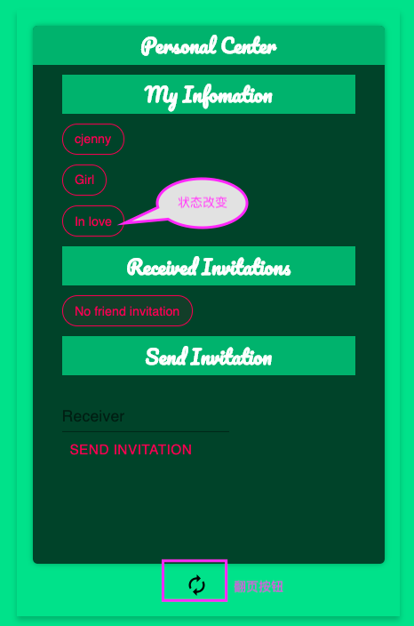

# LoveDiary

## 1. 项目立意

本项目主要利用了区块链的不可篡改、永久存证特性；

恋爱中的情侣为了追求仪式感和纪念意义经常会在某些景点留下自己的印记，想让这份印记象征着自己的爱情永久延续下去，有了区块链之后就不用如此大费周章了，本项目取名LoveDiary，利用区块链的不可篡改特性，可以让情侣们将一些重要的事件、日期写入区块链中，永远流传下去。

## 2. 开发细节

### 2.1 开发环境

合约开发框架：truffle

测试链：ropsten

前端：react + web3.js

### 2.2 合约

合约使用Unstructured Storage升级范式，主要包含两个合约文件：

* LoveDiaryStorage.sol 
* LoveDiaryLogicV0.sol

LoveDiaryStorage继承自[OwnedUpgradeabilityProxy](https://github.com/OpenZeppelin/openzeppelin-labs/tree/master/upgradeability_using_unstructured_storage)(OpenZeppelin开源的可升级合约模板)，主要负责存储应用业务数据，包含用户信息、用户消息等数据；LoveDiaryLogicV0继承自LoveDiaryStorage，添加了应用的业务逻辑；

在truffle的migration脚本中，首先部署LoveDiaryStorage.sol，随后部署LoveDiaryLogicV0.sol，然后调用LoveDiaryStorage的upgradeTo函数，将其逻辑实现指向LoveDiaryLogicV0.sol的地址；

如需升级合约逻辑，编写LoveDiaryLogicV1.sol（LoveDiaryLogicV1需继承自LoveDiaryLogicV0），然后编写truffle migration脚本，部署LoveDiaryLogicV1.sol后调用LoveDiaryStorage的upgradeTo函数将其逻辑实现指向新版本的LoveDiaryLogicV1合约地址；

## 3. 运行截图

1. 注册界面，用户可设置昵称、勾选性别后点击注册，并在metamask弹出窗口上confirm交易完成注册，此时演示我分别用两个地址注册一男一女两个用户

​	注册交易完成后会自动跳转到主页个人中心，如果用户已经注册过，点击connect wallet后应用获取用户的地址，检查确认注册过后跳转到主页个人中心。

2. 个人信息页

   包含了用户个人信息、用户收到的好友邀请、发送好友邀请三部分

   

   在发送好友邀请部分填写对方的地址，点击send invitation并确认交易后会向对方发起好友邀请

   

   如上图，好友邀请确认后对方会收到邀请，点击该邀请即可发起接受邀请的交易，接受邀请后双方个人状态都会从Single变为In love，随后点击最下方的旋转按钮即可翻页到日记页面

   

   3. 日记页面

      日记页面为聊天对话框形式，在下方对话框中输入想要记录的重要事件，点击submit并确认交易后即可将内容写入区块链，关系中的双方都可以向日记页面写入内容

      

      

## 4. 改进方向

时间有限，原先很多想法没有实现，列在此处作为后续改进方向：

1. 支持图片、视频等文件的上传，文件保存到ipfs，合约保存文件对应的multihash；目前只支持文本
2. 数据本地加密后上传，目前数据都是明文保存在链上，有隐私泄露风险
3. 改进UI界面